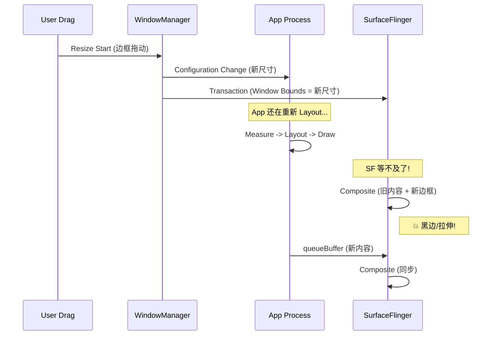

# PIP & Freeform Window Rendering

Android 的多窗口模式（Split Screen, Freeform, Picture-in-Picture）在渲染层面上并没有太多魔法，但理解其窗口组织形式对于性能分析很有帮助。

## 1. 窗口组织架构 (Window Hierarchy)

在 SurfaceFlinger 侧，所有的窗口都是 Layer Tree 的一部分。

*   **Task Layer**: 在多窗口模式下，系统会为每个 Task 创建一个根容器 Layer。
*   **Activity Layer**: Task 下面挂载各个 Activity 的 SurfaceControl。
*   **App Surface**: Activity 下面才是我们熟悉的 App Window Surface。

```mermaid
graph TD
    Display[Display Root]
    Stack[Stack / Task Container]
    WinA[Window A (Main App)]
    WinB[Window B (PIP / Freeform)]
    
    Display --> Stack
    Stack --> WinA
    Stack --> WinB
```

> *注: Android 12+ 已用 TaskFragment/RootTask 替代了 ActivityStack，具体层级名称因版本而异。*

## 2. PIP (画中画) 渲染流程

> PIP 模式从 Android 8.0 (API 26) 引入。

### 2.1 进入 PIP
1.  **Enter**: App 调用 `enterPictureInPictureMode()`。
2.  **Animation**: WindowManagerSystem (WMS) 接管窗口动画。
    *   WMS 使用 SurfaceControl 动画 API，将 App 的 Surface 缩小并移动到角落。
    *   *注意*: 在动画过程中，App 仍然在全分辨率渲染（或者根据 configuration change 变为小分辨率）。

### 2.2 持续渲染
在 PIP 模式下，App 的渲染循环与全屏模式**完全一致**：
1.  **Vsync**: 照常接收 Vsync-App。
2.  **Draw**: 照常绘制。
3.  **Submit**: 提交 Buffer。
4.  **Composite**: SF 将其作为一个小 Layer 合成到屏幕上。

### 2.3 性能考量
*   **Overdraw / 额外合成成本**: PIP 窗口悬浮在桌面或其他 App 之上，通常会带来额外合成成本；但实际代价取决于 HWC 是否能复用底层 layer、窗口覆盖面积以及设备策略。
*   **Touch Input**: 输入事件会被分发给 PIP 窗口，App 需要处理小窗口下的点击逻辑。
*   **Resource Budget**: 系统通常会限制 PIP 窗口的 CPU/GPU 优先级，确保主前台应用（Background Task）流畅。

## 3. Freeform (自由窗口 / 桌面模式)

这在折叠屏和平板电脑上越来越常见。

*   **Multiple Resizing**: 用户可以随意拉伸窗口。
*   **Latency**: 窗口边框的拖拽通常由 SystemUI 渲染（作为一个独立的 Layer），而 App 内容跟随 resize。
    *   如果 App 响应慢，会出现“黑边”或“内容拉伸”。
    *   **BLAST / Sync 机制很关键**: WMS 往往会尽量把“窗口边框大小”和“App 内容 Buffer”放入同一同步路径中，以减少这些瑕疵，但不能保证所有设备都完全消除黑边或拉伸。

## 4. Trace 分析特征

在 System Trace 中：
1.  **BufferQueue**: 每个独立窗口都有自己的 BufferQueue。
2.  **Vsync-App**: 所有可见窗口都会收到 Vsync。
3.  **Composition**: SurfaceFlinger 会处理所有可见 Layer 的合成。如果只有 PIP 窗口更新、背景保持不动，HWC 有时可以复用背景 layer 的结果；具体 trace 名称和策略依 Android 版本 / OEM 而异。

## 5. Freeform Resize 同步竞态 (Deep Dive)

在 Freeform 窗口拖拽调整大小时，存在一个经典的**竞态条件**，理解它对于分析"黑边"和"内容拉伸"问题至关重要。

### 5.1 竞态流程



### 5.2 BLAST Sync 解决方案

Android 12+ 通过 **BLAST / Sync** 机制显著缓解此问题：

1.  **Sync Token**: WMS 为这次 resize 生成一个 Token。
2.  **App Barrier**: App 完成新尺寸的渲染后，带着同一个 Token 提交 Buffer。
3.  **SF 等待**: SF 收到 Window Bounds Transaction 时，通常会尝试等待或关联对应 Token / SyncId 的 Buffer。
4.  **原子应用**: 两者更容易在同一提交边界内生效，从而降低撕裂、黑边和内容拉伸概率。

### 5.3 Trace 定位

在 Perfetto 中查找：
*   `wm_task_moved` / `WindowManager` 相关 slice（具体标签因 Android 版本和 OEM 而异）: 标记 resize 开始。
*   `Transaction.apply`: 查看是否带有 `SyncId`。
*   `SurfaceFlinger` 进程中的 Transaction 等待 slice（具体标签因版本而异）: 如果这个 Slice 很长，说明 App 响应慢。

### 5.4 优化建议

1.  **减少 Configuration Change 开销**: 避免在 `onConfigurationChanged` 中做重计算。
2.  **预渲染策略**: 如 Chrome 会预渲染几个常见尺寸的 Bitmap Cache。
3.  **Skeleton UI**: 在 resize 过程中显示骨架屏而非空白。
