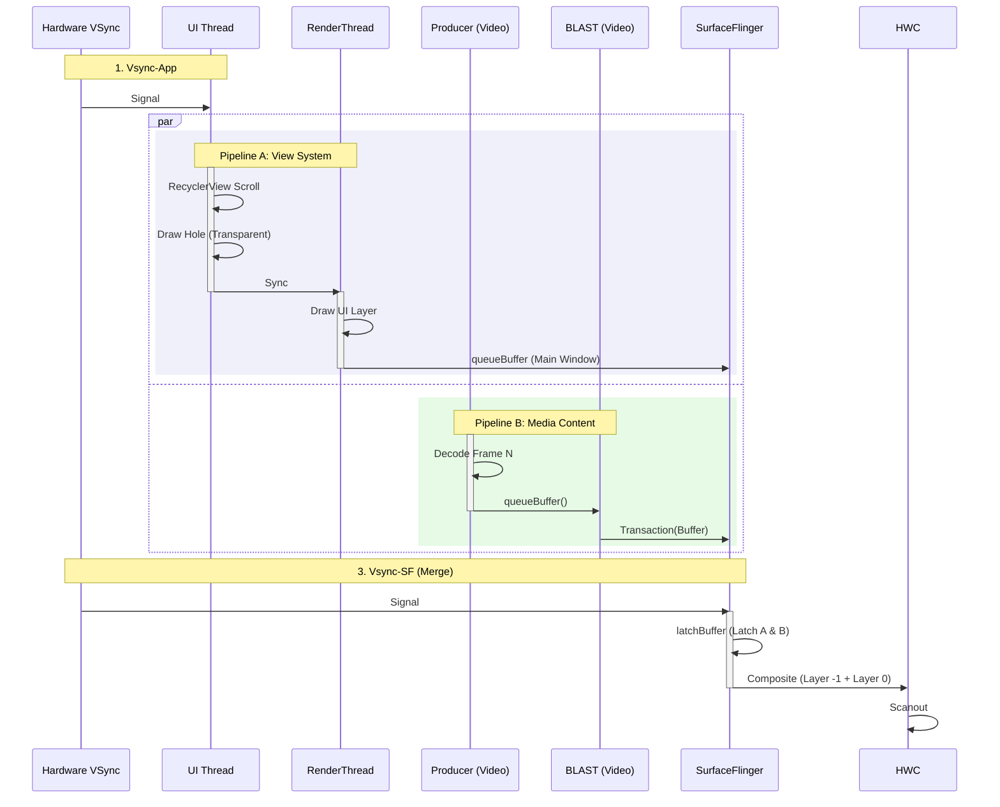

# Android View Mixed Pipeline (Hybrid Composition)

这是 Android App 中处理多媒体内容最常见的模式，也是 `scrolling-aosp-mixedrender` 模块所演示的核心场景。

**混合渲染 (Mixed Rendering)** 指的是：标准的 Android View 系统（UI + RenderThread）与独立的 SurfaceView（Producer Thread）在同一个界面中同时运行，最终由 SurfaceFlinger 进行视觉合成。

## 1. 核心架构：并行流水线

在这种模式下，App 内部存在两条完全独立的渲染流水线：

1.  **View Pipeline (UI)**:
    *   负责：RecyclerView, Toolbar, Buttons, Text。
    *   线程：UI Thread -> RenderThread。
    *   目标：`Layer 0` (App Main Window)。
2.  **Media Pipeline (Content)**:
    *   负责：视频流、直播流、3D 模型。
    *   线程：Decoder Thread / Game Logic Thread。
    *   目标：`Layer -1` (SurfaceView, 位于主窗口下方)。

## 2. 深度执行流程 (Deep Execution Flow)

### 阶段一：并行生产 (Parallel Production)
*   **Pipeline A (View)**: 响应 Vsync-App，执行 Measure/Layout/Draw，生成 DisplayList，同步给 RenderThread，生成 Main Window 的 Buffer。
*   **Pipeline B (Media)**: 独立于 Vsync（或尝试对齐），解码视频帧，直接 `queueBuffer` 到由于 SurfaceView 创建的独立 BufferQueue。

### 阶段二：打洞与合成 (Hole Punching & Composite)
1.  **Hole Punching / 独立层配合**:
    *   常见实现会让宿主窗口在 SurfaceView 区域不再绘制最终内容，或通过独立 layer / 裁剪策略为 SurfaceView 留出显示区域。具体机制不应简单固化为某个 `clipOut()` 调用。
2.  **SurfaceFlinger Latch**:
    *   SF 同时接收到两个 Surface 的 Buffer 更新。
    *   **Layer Z=0 (Top)**: App UI (带 clipOut 裁剪区域)。
    *   **Layer Z=-1 (Bottom)**: 视频内容 (relative Z-order，非全局 layer ID)。
3.  **Hardware Composite**:
    *   HWC 将这两层叠加，用户看到的是一张完整的界面。

---

## 3. 渲染时序图 (E2E)

这张图展示了双管线并行的特征。注意 Pipeline B 完全不被 UI Thread 阻塞。

## 4. 性能特征
*   **UI 卡顿不一定立刻拖慢视频**: 由于 SurfaceView 是独立 Surface，主线程卡顿时媒体面通常更容易保持连续；但如果几何变换、系统负载、Buffer 压力或 HWC 策略受影响，视频也可能一起抖动。
*   **同步挑战**: 如果列表快速滚动，SurfaceView 的位置变化（由 UI 控制）需要尽量与视频帧内容（由 Player 控制）对齐，否则会出现视频“飘移”或黑边。
    *   *解法*: Android 12+ 上 BLAST / Transaction 模型通常能显著减少这类竞态，但并不意味着所有设备都能保证“每一帧 UI 与每一帧视频完美同显”。
