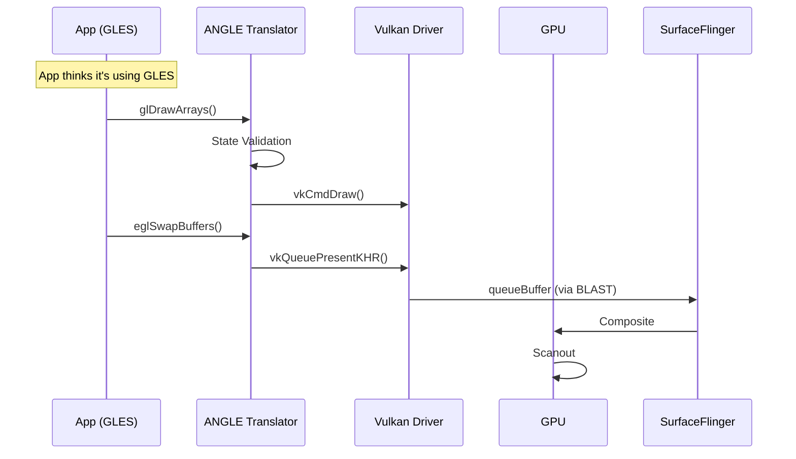

# ANGLE Rendering Pipeline (GLES-over-Vulkan)

> [!WARNING]
> **Android 15+ 推荐采用**: Android 15+ 将 ANGLE 作为重要的 GLES 兼容/统一实现方向纳入生态推进，但仍要以设备、OEM 与 provider 配置为准。如果您的 App 依赖厂商特定的 GLES 扩展（如 `GL_QCOM_*`），必须测试 ANGLE 兼容性或迁移到 Vulkan。

**ANGLE** (Almost Native Graphics Layer Engine) 是 Google 开发的开源图形抽象层，将 OpenGL ES API 翻译为底层原生 API (Vulkan/Metal/D3D)。从 Android 10 开始它已经可以在部分设备或调试路径中启用；到 Android 15+，它在生态中的重要性进一步提升，但是否默认启用仍要看具体设备。

## 1. 为什么需要 ANGLE？

传统 Android 图形栈的痛点：

| 问题 | 根因 | ANGLE 解决方案 |
|:---|:---|:---|
| **驱动碎片化** | 每个 GPU 厂商实现不同 | 统一的 ANGLE 翻译层 |
| **兼容性 Bug** | 厂商 GLES 驱动质量参差 | Google 维护的标准实现 |
| **调试困难** | 厂商驱动闭源 | ANGLE 开源，可 Debug |
| **Vulkan 资源利用** | 老 App 用 GLES 无法享受 Vulkan 优势 | 透明翻译到 Vulkan |

## 2. 核心架构

```mermaid
graph TD
    subgraph "App Layer"
        App[App (GLES Calls)]
    end
    
    subgraph "ANGLE Layer"
        Translator[GLES -> Vulkan Translator]
        Shader[SPIR-V Compiler]
        State[State Tracker]
    end
    
    subgraph "System"
        VK[Vulkan Driver]
        GPU[GPU]
    end
    
    App -->|glDrawArrays| Translator
    Translator -->|vkCmdDraw| VK
    Translator -->|Shader| Shader
    Shader -->|SPIR-V| VK
    VK -->|Execute| GPU
```

## 3. 启用检测

### 3.1 运行时检测

```java
// 检查 ANGLE 是否启用
String renderer = GLES20.glGetString(GLES20.GL_RENDERER);
boolean isANGLE = renderer.contains("ANGLE");

// 获取后端
// "ANGLE (Google, Vulkan 1.3.x, ...)"
```

### 3.2 adb 命令

```bash
# 查看当前 ANGLE 状态
adb shell settings get global angle_gl_driver_all_apps

# 强制所有 App 使用 ANGLE
adb shell settings put global angle_gl_driver_all_apps angle

# 恢复系统默认
adb shell settings delete global angle_gl_driver_all_apps
```

## 4. 渲染时序图

注意 GLES 调用被翻译为 Vulkan 调用。



## 5. 性能特征

### 5.1 优势

| 方面 | 传统 GLES Driver | ANGLE-Vulkan |
|:---|:---|:---|
| **Draw Call 开销** | 较高 (状态机) | 较低 (显式状态) |
| **多线程** | 有限 | 完全支持 |
| **Shader 编译** | 运行时 | GLSL → SPIR-V 翻译 + Vulkan pipeline cache |
| **调试工具** | 厂商特定 | RenderDoc 统一 |

### 5.2 开销

*   **翻译层开销**: 存在额外状态转换和命令翻译成本，但具体开销强依赖 workload，不宜写死固定百分比。
*   **首次 Shader 编译**: 稍慢 (GLSL → SPIR-V → GPU Binary)
*   **内存**: 略高 (需要维护翻译状态)

## 6. Trace 分析

在 Perfetto 中 ANGLE 的特征：

1.  **GPU / Vulkan 侧信号**: 可能更多看到 `vkQueue*` / `vkCmd*` 而非纯 `glDraw*`
2.  **ANGLE Thread**: 可能有独立的翻译 / 状态管理线程
3.  **Shader Compile**: 某些 build / tracing 配置下可能出现 `ANGLE` 相关编译 slice

### 6.1 常见问题定位

```sql
-- 查找 ANGLE 相关耗时
SELECT name, dur FROM slice 
WHERE name LIKE '%ANGLE%' OR name LIKE '%vk%'
ORDER BY dur DESC LIMIT 20;
```

## 7. 开发者建议

1.  **测试覆盖**: 确保 App 在 ANGLE 和 Native GLES 下都测试过
2.  **避免厂商扩展**: 如 `GL_QCOM_*`, ANGLE 可能不支持
3.  **Shader 优化**: ANGLE 对 Shader 要求更严格，不合规的 GLSL 会报错
4.  **调试模式**: 使用 `angle_debug_layers` 开启验证层
5.  **优先 Vulkan**: 新项目建议直接使用 Vulkan，避免 ANGLE 翻译层开销

## 8. 兼容性

| Android 版本 | ANGLE 状态 |
|:---|:---|
| **Android 16** (API 36) | 生态方向继续推进 ANGLE / AVP，但仍依设备策略 |
| **Android 15** (API 35) | ANGLE 重要性提升，默认与否看设备 / OEM |
| Android 14 (API 34) | 更多设备开始实验 / 采用 |
| Android 13 (API 33) | 部分设备可见 |
| Android 12 (API 31) | 持续改进 |
| Android 11 (API 30) | 部分设备可见 |
| Android 10 (API 29) | 实验性，需手动启用 |
