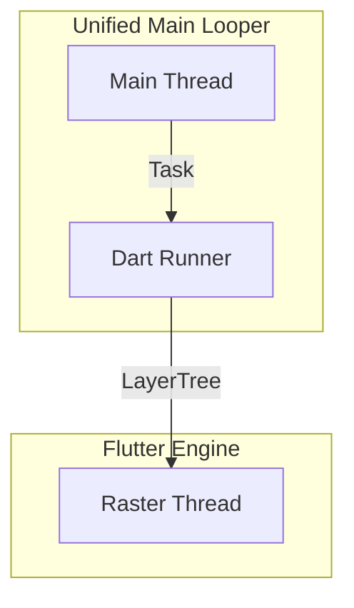

# Flutter Rendering Architecture (Index)

Flutter 的渲染架构随着版本演进发生了巨大变化。为了更好地理解其微观实现，我们将文档拆分为以下几个部分。

## 1. 核心版本演进

| 特性 | Flutter 3.19 (Legacy) | Flutter 3.32+ (Modern default on Android/iOS) |
| :--- | :--- | :--- |
| **渲染引擎** | Skia | Impeller 默认更常见；Android 上常用 Vulkan / OpenGL ES，仍可能回退 |
| **线程模型** | 常见为独立 `ui` / `raster` 线程 | **Merged Platform Model** 更常见，UI task runner 默认并入 Main Looper |
| **典型 Trace** | 常见看到独立 `1.ui` / `1.raster` | 线程名与 slice 名更依赖版本、构建方式与 trace 配置，不宜写死 |

## 2. 线程模型 (Merged Model)

在较新的 Flutter 版本中，Flutter 的 UI TaskRunner 与 Android Main Looper 合并（Merged Platform Thread）已成为 Android 上的主流默认行为。公开信息显示该行为到 Flutter 3.32 stable 已默认开启；更早版本存在实验期和分阶段落地。合并减少了 UI 线程与 Platform 线程之间的切换和消息转发开销，但并不意味着所有 trace 都会稳定出现同名 `ui` / `main` slice。

> *Merged Model 下 Main 和 Dart Runner 是同一线程上的两个 TaskRunner 身份，非独立实体。*

## 3. 详细渲染管线 (Pipelines)

请根据具体的集成模式查看对应的详细文档：

### 3.1 [SurfaceView 模式 (常见默认 render mode)](flutter_surfaceview.md)
*   **适用场景**: 全屏 Flutter 应用，或宿主允许使用独立 Surface 的嵌入场景。
*   **架构**: 独立 Surface，Flutter 内容通常不经过宿主 App RenderThread。
*   **关键词**: `Impeller`, `SurfaceView`, `BLAST`, `独立 Layer`.

### 3.2 [TextureView 模式 (render mode 兼容路径)](flutter_textureview.md)
*   **适用场景**: 需要半透明、旋转、裁剪，或必须嵌入复杂 View 层级中。
*   **架构**: 渲染到纹理，再由宿主侧进行合成。
*   **关键词**: `SurfaceTexture`, `宿主合成`, `额外采样/同步`.

> `TextureView` render mode 与 Platform Views 的 `Hybrid Composition / Texture Layer Hybrid Composition` 是两套不同概念。前者决定 Flutter 根 Surface 怎么出图，后者决定嵌入原生 View 时如何与 Flutter 内容组合。
