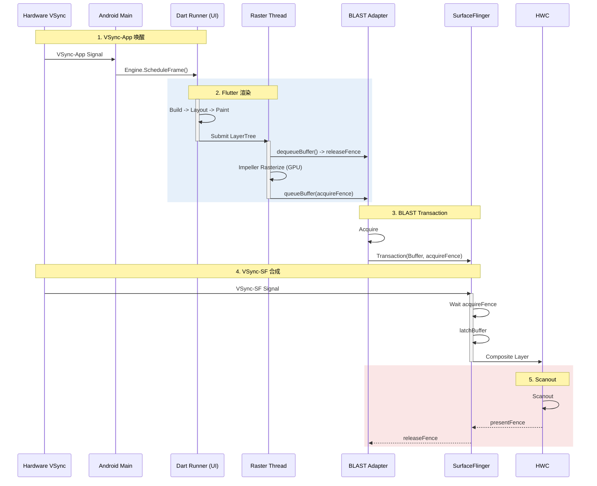

# Flutter SurfaceView Pipeline (Common Render Mode)

这是 Flutter 在 Android 上最常见的高性能 render mode。`FlutterFragment` / `FlutterView` 的默认 render mode 通常是 `SurfaceView`，它利用独立 Surface 与 SurfaceFlinger 合成；宿主原生 View 仍然可能走标准 Android View / RenderThread 链路。

## 1. 独立合成流程详解 (Deep Execution Flow)

在此模式下，Flutter 的渲染流水线与 Android 原生 UI 线程几乎完全去耦，除了 Vsync 信号的驱动。

### 第一阶段：Dart Runner (UI Thread)
1.  **Vsync**: 引擎层收到信号，驱动 Dart 运行。
2.  **Build (构建)**: 运行 `Widget.build()`。这就像搭积木，决定“界面长什么样”。
    *   *产物*: Element Tree (更稳定的结构)。
3.  **Layout (布局)**: `RenderObject.performLayout()`。
    *   计算每个渲染对象的大小和位置。这对应 AOSP 的 Measure/Layout，但全在 Dart 里完成。
4.  **Paint (绘制)**: `RenderObject.paint()`。
    *   **关键**: 这里也不产生像素，而是生成一个 **Layer Tree** (图层树)。它好比是一份“绘图指令列表”。
5.  **Submit**: Dart 线程把 Layer Tree 打包，发给 Raster Thread。

### 第二阶段：Raster Thread (光栅化)
1.  **LayerTree Processing**: 拿到 Dart 发来的指令树，进行优化和合成。
2.  **Rasterization (Impeller)**:
    *   Android 上 Impeller 常见后端是 Vulkan；在不支持的设备上也可能回退到 OpenGL ES 路径。
    *   Impeller 倾向于使用预编译 shader / 更可预测的 pipeline 建立流程，通常能减少 Skia 时代的运行时 shader 编译卡顿，但具体收益仍依设备和效果而异。
3.  **Present (直接提交)**:
    *   通过 `vkQueuePresentKHR` (Vulkan) 或 `eglSwapBuffers` (GL)。
    *   **关键**: 这一步直接写入到一张独立的 SurfaceBuffer 中。
    > *注: 指 Flutter 自身的渲染内容。宿主 App 的原生 View（如系统状态栏）仍走标准 RenderThread 路径。*

### 第三阶段：BLAST Submission (系统合成)
1.  **queueBuffer / Present**: Flutter 渲染结果通过底层图形栈提交到 Surface。
2.  **BLAST Adapter**: 在较新的 Android 设备上，Surface 更新通常会通过 BLAST / Transaction 模型进入 SurfaceFlinger。
3.  **Atomic Sync**: 如果这个 Transaction 包含了 Window 的位置变化（比如 resize），它们会原子生效。
4.  **SurfaceFlinger**: 收到 Transaction，直接合成到屏幕，**Flutter 内容不经过 App RenderThread**（宿主原生 View 仍走 RenderThread）。

---

## 2. 渲染时序图

这张图展示了从 Dart 构建到最终 BLAST 合成的全过程。

## 3. 线程角色详情 (Thread Roles)

| 线程名称 | 关键职责 | 常见 Trace 标签 |
|:---|:---|:---|
| **ui / main / 1.ui** | Dart 代码执行, Build/Layout/Paint | 常见可见 `Engine::BeginFrame`，但线程/标签不稳定 |
| **raster / 1.raster** | Layer Tree 光栅化, GPU 指令生成 | 常见可见 `Rasterizer::DrawToSurfaces`、`EntityPass::*`，但不保证稳定 |
| **1.io** | 图片解码, 资源加载 | `ImageDecoder`（Skia 引擎下还有 `SkiaUnrefQueue`） |
| **1.platform** | 平台通道调用 | `MethodChannel` |
| **SurfaceFlinger** | 合成 Flutter Layer 与系统 UI | 常见可见 `latchBuffer` / FrameTimeline / SF 主循环片段 |

---

## 4. Platform View 兼容性限制

当 Flutter 应用需要嵌入原生 Android View（如 Google Maps、WebView）时，SurfaceView 模式存在根本性限制。

### 4.1 为什么不兼容

| 问题 | 根因 |
|:---|:---|
| **Z-Order 冲突** | 原生 View 和 Flutter SurfaceView 是两个独立的 Layer，无法交错 |
| **手势穿透** | 触摸事件分发路径不一致 |
| **裁剪/圆角** | SurfaceView 不支持 `clipPath` 等 View 变换 |

### 4.2 PlatformView 不是“自动降级到 TextureView”

Flutter Android 上需要区分两套配置：

1.  **Flutter 根视图 render mode**: `SurfaceView` 或 `TextureView`
2.  **Platform Views composition mode**: `Hybrid Composition` 或 `Texture Layer Hybrid Composition`

嵌入 `PlatformView` 时，Flutter 不一定“自动切到 TextureView render mode”。更常见的是在当前 render mode 下，针对具体平台视图选择 HC / TLHC 等组合方式；是否切换、代价多大，取决于宿主、Flutter 版本、视图类型和具体实现。

### 4.3 开发者建议

1.  **尽量减少 PlatformView 数量**: 多个 PlatformView 往往会引入额外合成、同步和输入成本，但开销没有稳定的固定百分比。
2.  **优先使用 Flutter 原生组件**: 如 `flutter_map` 代替 Google Maps。
3.  **监控组合方式**: 在 Perfetto 中可观察 `SurfaceTexture`、宿主 RenderThread、平台视图线程与 Flutter raster 的相对关系，但不要把单个 slice 名当成唯一判据。
