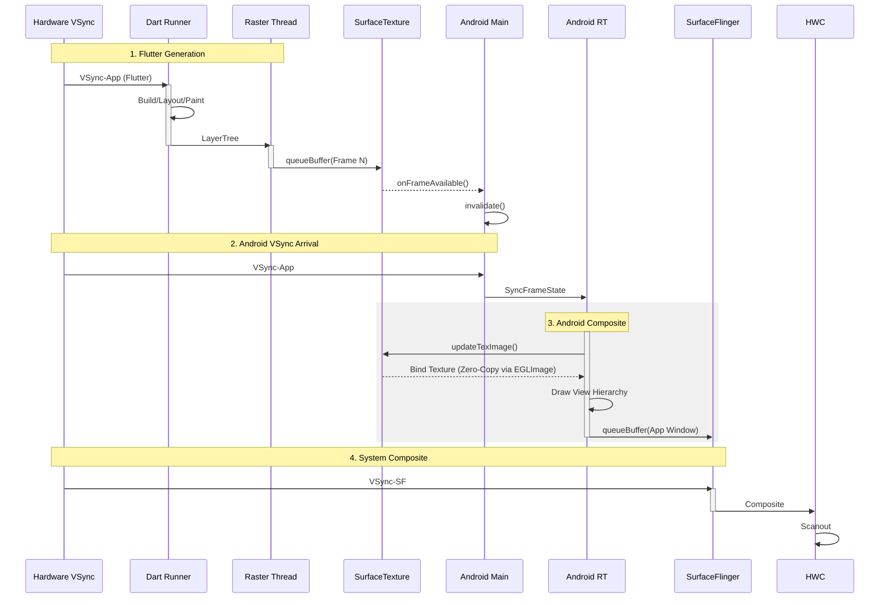

# Flutter TextureView Pipeline (Render Mode / Host Composition)

当宿主需要将 Flutter 视图嵌入复杂的 Android View 层级中，或者需要对 Flutter 根视图做半透明、旋转、裁剪等 View 级变换时，常会使用 `TextureView` render mode。它和 PlatformView 的 HC / TLHC 不是同一个概念，但两者组合后通常会进一步放大合成成本。

## 1. 混合渲染流程详解 (Deep Execution Flow)

在此模式下，Flutter 更像一个向 `SurfaceTexture` 供帧的内容生产者，最终仍要经过宿主侧的 View / RenderThread 合成链路。

### 第一阶段：Flutter 生产 (Dart & Raster)
与 SurfaceView 模式类似，Dart 进行 Build/Layout/Paint，Raster 进行光栅化。
*   **差异点**: Raster Thread 的目标不是一张独立的 Surface，而是一个 **SurfaceTexture** (纹理对象)。
*   **Present**: 调用 `queueBuffer` 后，它不会直接发给系统，而是触发一个回调通知 Java 层。

### 第二阶段：Main Thread Roundtrip (主线程周转)
这是性能隐患的核心，但 **Flutter 3.29+** 对此进行了重大优化：

#### Legacy (<=3.24)
1.  **Frame Available**: `SurfaceTexture` 在任意线程触发回调。
2.  **Lock**: 需要竞争锁来跨线程通知。

#### Modern (Merged Model)
在较新的 merged model 中，Flutter UI task runner 默认更常与 Main Looper 对齐，这减少了 Platform Channel / 配置阶段的跨线程开销；但 `SurfaceTexture` 的创建、监听回调线程和消费线程仍取决于具体实现，不应简单写成“强制绑定 Main Thread”。
1.  **Ownership**: merged model 降低 UI 与 platform task runner 之间的切换成本。
2.  **Reduced Overhead**: `onFrameAvailable` 回调线程取决于 `SurfaceTexture` / listener 的绑定方式；即便 merged model 生效，Raster Thread → SurfaceTexture → 宿主 RenderThread 的同步和调度仍然存在。
3.  **Invalidate**: 宿主通常仍需要通过 View invalidation 进入下一轮宿主合成。
4.  **Wait Vsync**: 由于最终需要落到宿主 View 树，这条路径通常仍受宿主帧节奏约束。

### 第三阶段：RenderThread Composite (渲染线程合成)
1.  **updateTexImage / acquire latest image**: 宿主侧在绘制这一帧 View 树时，常会消费 `SurfaceTexture` 的最新图像；是否稳定可见 `updateTexImage`，取决于版本和 trace 配置。
2.  **Draw**: 把它当做一张图片画在 App 的主 Framebuffer 上。
3.  **BLAST**: 最终，App 的主 Framebuffer 通过 BLAST 提交给 SurfaceFlinger。

**结论**: Flutter 画面通常要先生成到 `SurfaceTexture`，再由宿主侧参与一次纹理采样/合成，因此整体带宽和同步成本通常高于 `SurfaceView` render mode。

---

## 2. 渲染时序图

注意图中的 "Main Thread Roundtrip" 和 "Double Draw"。

