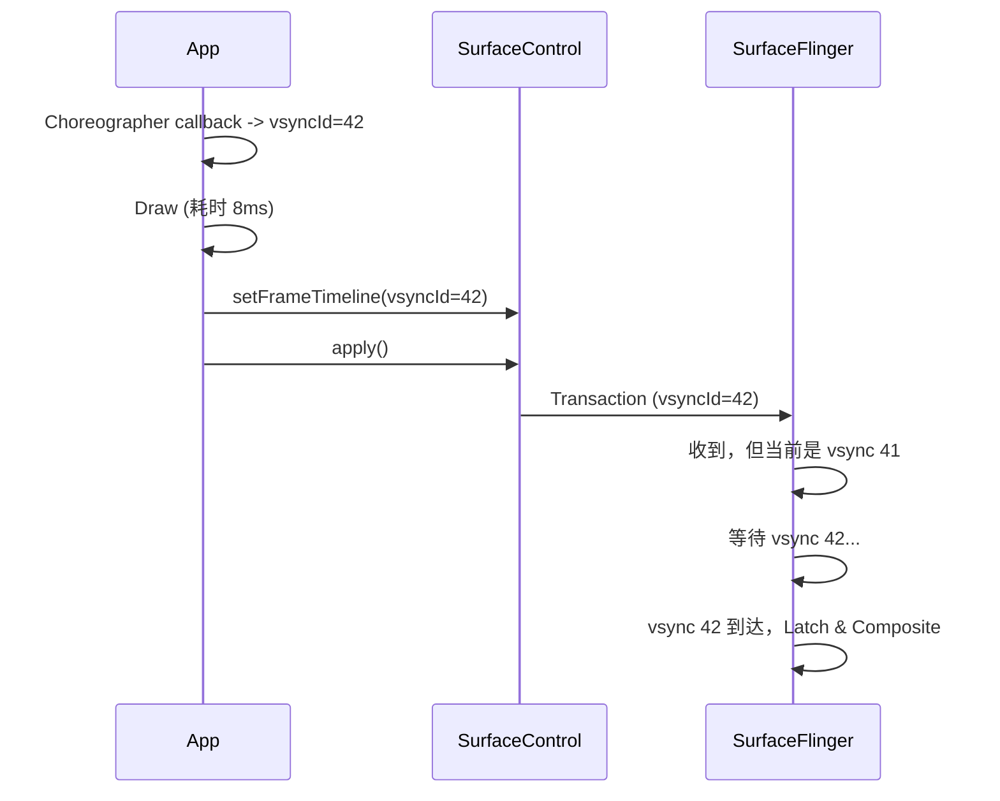

# SurfaceControl API Deep Dive (NDK)

在 Android NDK 开发中，`ASurfaceControl` (Android 10/Q 引入, API 29) 是与 SurfaceFlinger 进行低级交互的核心接口。它赋予了 App 像 WindowManager 一样的能力来操控图层。

## 1. 核心概念

*   **ASurfaceControl**: 代表 SurfaceFlinger 中的一个 Layer（图层）。它可以是一个 Buffer 容器（显示内容），也可以是一个纯容器（Color Layer / Container Layer）。
*   **ASurfaceTransaction**: 代表一组原子操作。你可以一次性修改多个 SurfaceControl 的属性（位置、大小、Buffer、Z-Order），然后 commit。

## 2. 与 BLAST 的关系

NDK 的 SurfaceControl API 与 BLAST 共享同一个“事务式更新 Surface / Layer 状态”的体系，但二者不应简单画等号。BLAST 是现代 Android 图形栈里围绕 Buffer + Transaction 协同更新的一条常见路径；`ASurfaceControl` / `ASurfaceTransaction` 则是应用直接操控 Layer/事务的低级接口。

*   **Atomicity**: `ASurfaceTransaction_apply()` 让同一事务中的多个属性更新以统一快照的方式提交给系统。
*   **Sync**: 可以通过 `ASurfaceTransaction_setBuffer` 将 Buffer 与几何/可见性等属性一并提交；最终何时 latch 和显示，仍由 SurfaceFlinger / HWC / fence 状态共同决定。

## 3. 典型使用流程

### 步骤 1: 创建 SurfaceControl
你需要一个父 SurfaceControl（通常来自 `SurfaceView.getSurfaceControl()`）或者直接挂载到 Display。

```c
// 从现有 SurfaceControl 创建子 Layer
ASurfaceControl* child = ASurfaceControl_create(parent, "MyOverlay");

// 或从 ANativeWindow 创建
ASurfaceControl* child = ASurfaceControl_createFromWindow(window, "MyOverlay");
```

### 步骤 2: 配置 Transaction
创建并配置一个事务：

```c
ASurfaceTransaction* transaction = ASurfaceTransaction_create();

// 设置 Buffer (来自 AHardwareBuffer)
ASurfaceTransaction_setBuffer(transaction, child, hardwareBuffer, fence);

// 设置位置
ASurfaceTransaction_setPosition(transaction, child, x, y);

// 设置层级
ASurfaceTransaction_setZOrder(transaction, child, 10);

// 设置可见性
ASurfaceTransaction_setVisibility(transaction, child, ASURFACE_TRANSACTION_VISIBILITY_SHOW);
```

### 步骤 3: 提交 Transaction
```c
ASurfaceTransaction_apply(transaction);
```
这一步会将打包好的数据发送给 SurfaceFlinger。

## 4. 关键 API 详解

### Buffer Management
*   `ASurfaceTransaction_setBuffer(..., ASurfaceTransaction_ASurfaceControl* sc, AHardwareBuffer* buffer, int fence_fd)`
    *   这是最核心的 API。你必须自己管理 `AHardwareBuffer` 的生命周期。
    *   `fence_fd`: 一个 acquire fence。SF 会等待这个 fence signal 后才去读 buffer。

### Hierarchy Management
*   `ASurfaceTransaction_reparent(...)`
    *   动态改变图层树结构。例如将一个图层从 SurfaceView 移到 Activity 顶层（实现画中画动画）。

## 5. 优势与场景

*   **WebView Out-of-process Rasterization**: 浏览器在独立进程合成页面，直接通过 SurfaceControl 发给 SF，不经过 App 主线程。
*   **Custom Video Player**: 可以实现极其复杂的视频弹幕融合效果。
*   **Dynamic UI**: 自绘引擎、浏览器内核、视频/动画系统都可能利用 SurfaceControl 构造独立 layer；是否用于 Flutter PlatformView 取决于具体集成策略，而不是固定结论。

## 6. 注意事项

*   **生命周期**: `ASurfaceControl` 是内核资源，必须及时 Release。
*   **Fence Leak**: 必须正确处理 Fence FD，否则会导致系统挂起。传递给 API 后，FD 的所有权通常会转移给系统（Close on exec）。

## 7. Frame Timeline API (Android 11+)

从 Android R 开始，SurfaceControl API 新增了 **Frame Timeline** 系列接口，用于精准控制帧的着陆时间。

### 7.1 核心 API

```c
// 通过 Choreographer 获取 VSync ID (Android 12+)
// App 在 AChoreographer_postVsyncCallback 回调中获取 vsyncId
// 然后传给 ASurfaceTransaction_setFrameTimeline

// 设置目标帧时间线 (Android 12+)
ASurfaceTransaction_setFrameTimeline(
    transaction,
    vsyncId   // 告诉 SF：这帧打算在这个 VSync 着陆
);
```

### 7.2 工作原理



### 7.3 性能优势

1.  **消除掉帧误判**: SF 知道这帧是故意"迟到"的（因为帧率设定），不会错误标记为 Jank。
2.  **支持动态帧率**: 配合 VRR 屏幕，App 可以精准控制 30/60/90/120fps 切换。
3.  **Perfetto 可视化**: 在 FrameTimeline Track 中可以看到 Expected vs Actual Present Time。

### 7.4 使用场景

*   **视频播放器**: 24fps/30fps 视频在 60Hz 屏幕上避免 3:2 pulldown 抖动。
*   **游戏引擎**: 在 GPU 负载高时主动降频，而非被动掉帧。
*   **省电模式**: 低功耗场景主动请求 30fps 渲染。
