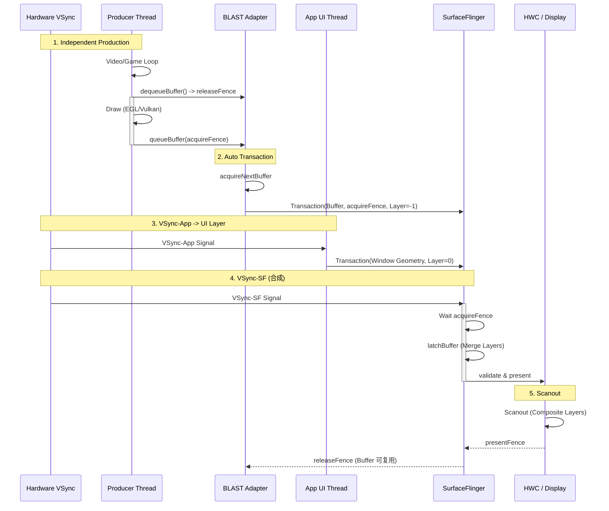
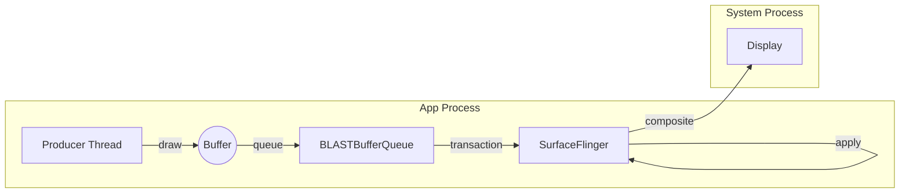

# SurfaceView Rendering Pipeline (Direct Producer via BLAST)

`SurfaceView` 是 Android 历史上最高效的视图组件之一。在 Android 11+ / 12+ 的现代设备上，它通常受益于 **BLAST** / Transaction 模型带来的几何与 Buffer 更新协同，但不应把所有机型都描述成“完全同一种 BLAST 内部实现”。

## 1. 生产者-消费者流程详解 (Deep Execution Flow)

SurfaceView 的核心在于“去耦”：它把绘图任务从 App 主线程剥离了出来。

### 第一阶段：Producer Thread (生产者)
这通常是视频解码线程 (MediaCodec) 或游戏逻辑线程：
1.  **dequeueBuffer**: 从 BufferQueue 拿一个空 Buffer。如果队列满了（Consumer 没来得及看），这里会阻塞。
2.  **Draw (绘制)**:
    *   **Canvas模式**: `lockCanvas()` -> 获得 Bitmap -> 涂鸦 -> `unlockCanvasAndPost()`。
    *   **GLES模式**: `eglMakeCurrent` -> `glDraw` -> `eglSwapBuffers`。
3.  **queueBuffer**: 绘制完成，把 Buffer 放回队列，并通知 Consumer。

### 第二阶段：Consumer (SurfaceFlinger)
注意，SurfaceView 的消费者**不是** App 进程，而是系统进程 SurfaceFlinger：
1.  **Acquire**: SF 收到 Buffer 可用的通知，拿走 Buffer。
2.  **Latch & Composite**: SF 在下一个 Vsync 到达时，把这个 Buffer 和 App 的主窗口（上面挖了个洞）叠在一起。
    *   *优势*: 这一步通常不经过 App 主线程，所以在主线程卡顿时，SurfaceView 内容往往更容易保持连续；但若系统资源紧张、窗口几何频繁变化或 producer 自身受阻，画面仍可能抖动。

---

## 2. 核心机制：挖洞 (Punch Through) & BLAST

SurfaceView 在 WMS 侧是一个独立的图层 (Layer)。
*   App 的主窗口通常不会在 SurfaceView 区域绘制最终内容，或会通过独立 layer / 裁剪策略为其留出显示区域。
*   SurfaceView 的独立 Surface 会以相对 Z-order 与主窗口配合显示。
*   **BLAST 的改进**: App 的 UI 变化（比如 SurfaceView 的尺寸改变、位置移动）和 SurfaceView 内容更新更容易被系统放入同一事务模型中协调，但这是一种“减竞态”机制，不是对逐帧完美同步的绝对保证。

### Z-Order 示意图

```mermaid
graph TD
    Display[Display Screen]
    Win[App Window (Z=0, Hole)]
    SV[SurfaceView Layer (Z=-1)]
    
    Display --> Win
    Display --> SV
    style Win fill:#00000000,stroke:#333,stroke-width:2px,stroke-dasharray: 5 5
    style SV fill:#f9f,stroke:#333,stroke-width:4px
```

---

## 3. 详细渲染时序图 (BLAST Sync)

这个图展示了 BLAST 如何让独立的 Producer 和 App 的 UI 变化保持同步。



1.  **queueBuffer**: 在现代实现中，`queueBuffer` 往往会先进入本地事务/适配层，再由系统侧统一处理。
2.  **Transaction**: 所有的 buffer 提交最终都变成了一个 `SurfaceControl.Transaction`。
3.  **Sync**: 如果结合 `setFrameTimeline()` 等高级 API，App 可以向系统表达更强的帧对齐意图，但系统最终是否能做到同帧着陆，仍取决于生产时序、Buffer 可用性和显示策略。

---

## 4. Buffer 流转示意图



## 5. 优缺点与 Trace 特征

*   **优点**:
    *   **同步更稳 (vs Legacy)**: 通常能明显减少 SurfaceView 跟手性差、缩放闪烁等问题，但不是所有场景都能“彻底解决”。
    *   **低功耗**: 保持了 Direct Composition / 独立 Layer 的优势。
*   **Trace 特征**:
    *   可能看到 `BLASTBufferQueue`、`queueBuffer`、`setTransactionState` 等系统侧信号，但这些名字不应作为唯一判据。
    *   如果开启了更强的同步路径，可能会看到与 Transaction / wait / frame timeline 相关的系统 slice。
