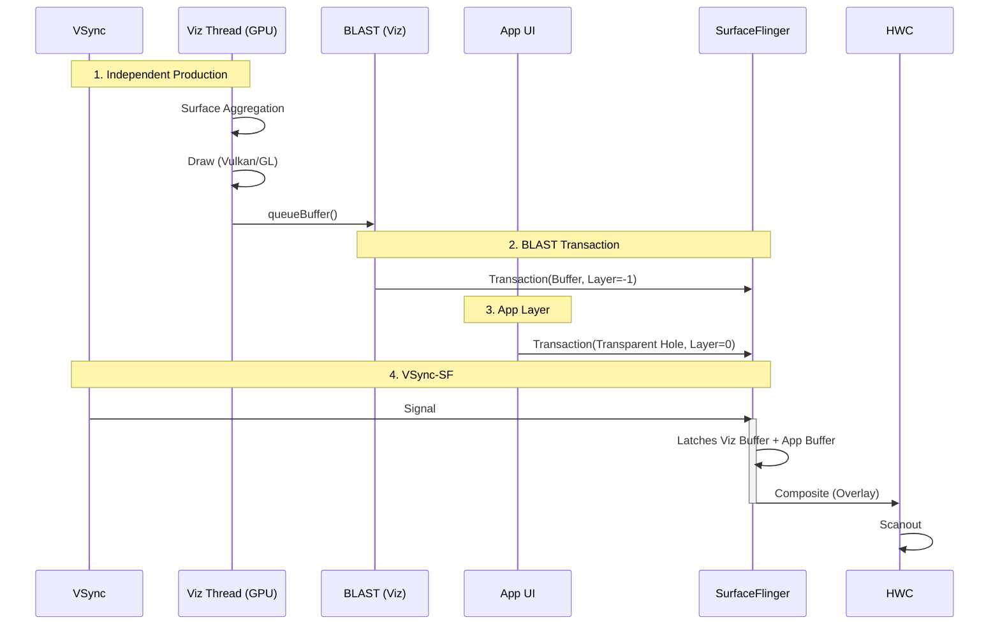

# WebView SurfaceControl Pipeline (Viz/OOP-R)

当设备与 WebView provider 满足一系列条件时，WebView 可能切换到现代化的独立合成模式：(1) Android / provider 支持 SurfaceControl 相关能力；(2) Chromium 对应 feature 启用；(3) GPU / driver / 内核路径满足兼容性条件。它是一个**条件成立时可能出现**的路径，不应视为所有现代 WebView 的固定默认模式。

**注意**：此模式与 `SurfaceView` 包装模式不同。WebView 的 browser code、GPU / network 等服务通常仍在宿主 app 进程内；renderer 进程是否独立取决于 multiprocess 配置。独立 child layer 的提交可能由 Chromium 的 compositor / viz 相关线程完成，线程名也可能表现为 `VizCompositorThread`、provider 自定义线程或更泛化的 compositor worker。

## 0. 初始化与模式切换

1.  **Factory Init**: 同样由 `WebViewChromiumFactoryProvider` 初始化。
2.  **Mode Switch (Vulkan/OOP-R)**:
    *   Chromium 内核决定开启独立合成。
    *   请求系统创建一个 `ASurfaceControl` (Child Layer)。
    *   这个 Layer 直接由 App 进程内的 Viz Compositor 线程管理，App 的 RenderThread 通常只负责给它一个容器位置。
3.  **Hole Punching**:
    *   App 的 RenderThread 在 WebView 所在区域绘制透明占位矩形，Viz 创建 z-order 低于 App Window 的 SurfaceControl child layer。SurfaceFlinger 合成时将两层叠加。

---

## 1. 独立合成流程详解 (Deep Execution Flow)

此模式下，WebView 像 SurfaceView 一样工作，完全绕过 App 的 `RenderThread`。

### 第一阶段：Chromium 合成侧 (Viz / compositor services)
1.  **Receive Frame**: 接收来自 Renderer 进程的 CompositorFrame。
2.  **Surface Aggregation**: 聚合多个 Surface（如网页内容 + 视频图层）。
3.  **Draw**:
    *   在独立的 **Viz / compositor 线程** 中，通过 SkiaRenderer 等后端使用 GL 或 Vulkan 绘制合成结果。
    *   绘制目标是一个独立的 `GraphicBuffer`。

### 第二阶段：BLAST Submission (系统合成)
1.  **queueBuffer / submit buffer**: 绘制完成后，Buffer 会通过 SurfaceControl / Transaction 路径提交。
2.  **Transaction**: 由 Chromium / provider 封装为 SurfaceControl Transaction。
3.  **SurfaceFlinger**:
    *   SF 收到这个 Transaction，将其直接合成到屏幕上。
    *   App 的 Window 上对应位置通常是一个透明洞（Hole Punching）。

### 性能优势
*   **隔离性**: 网页内容与宿主 UI 的耦合通常更低，但“网页卡死而宿主始终完全流畅”仍受设备资源、进程调度和窗口同步影响。
*   **视频性能**: 在满足 overlay / secure / layer 策略时，视频可能受益于更直接的提交路径；并非所有页面视频都会走同一条最优路径。

---

## 2. 渲染时序图

注意 App RenderThread 在此模式下的空闲状态。

